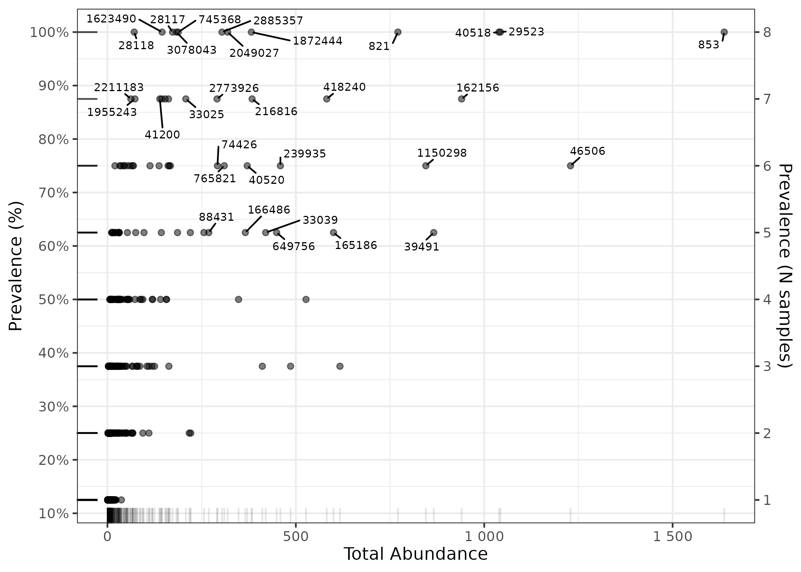
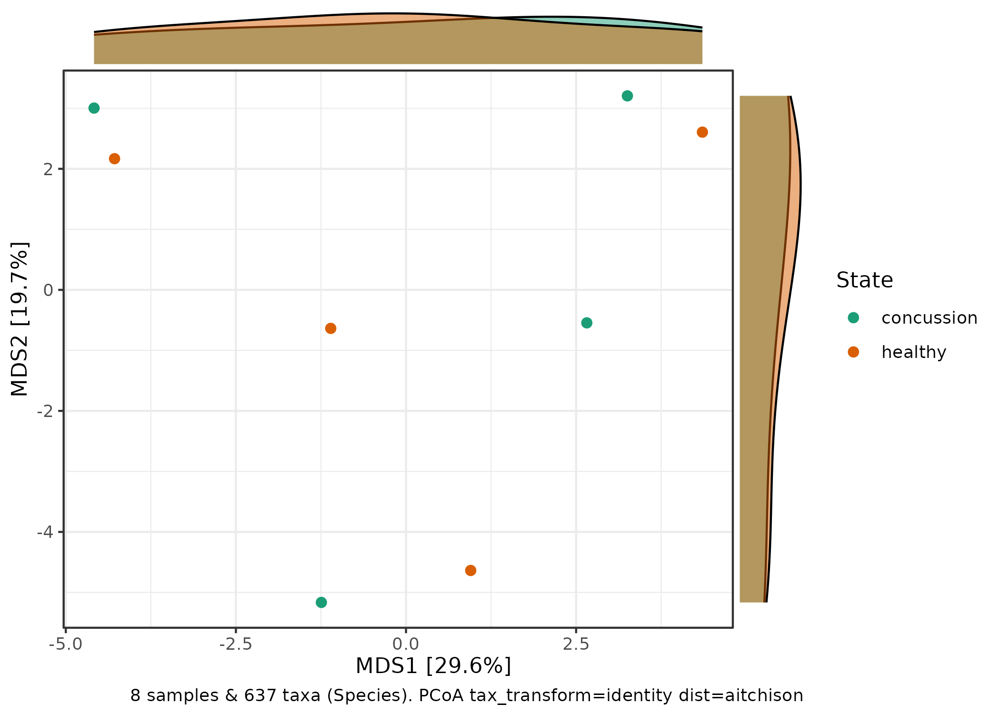
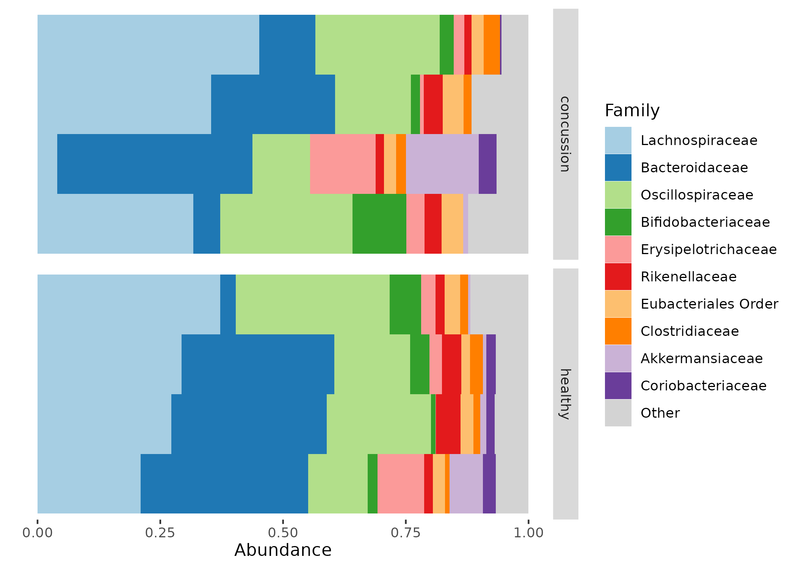
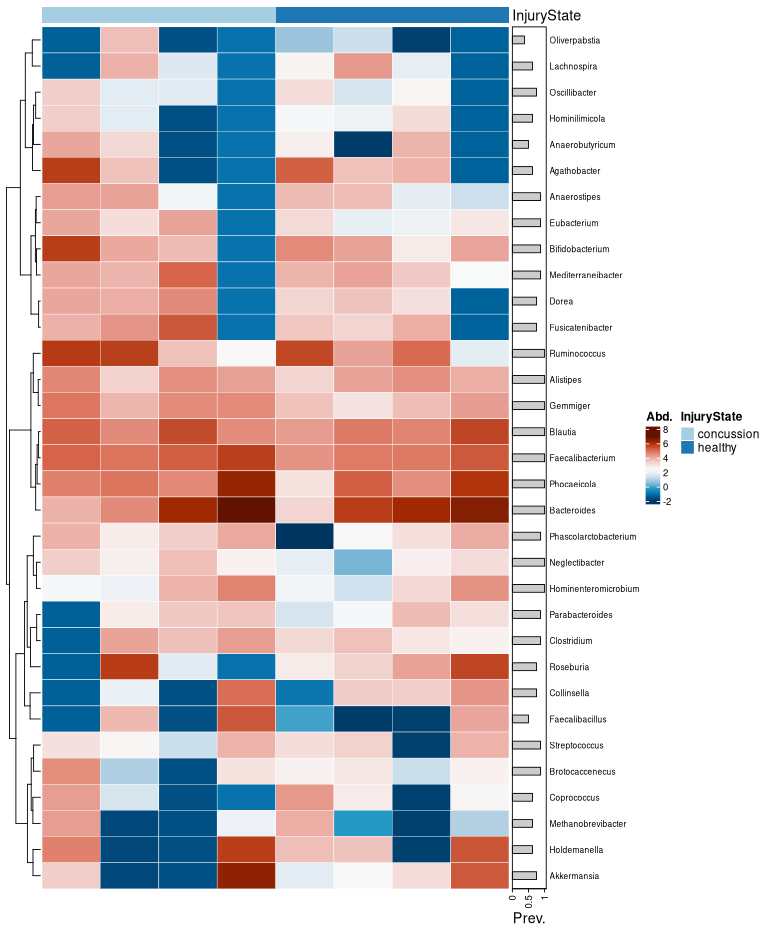

## Introduction

This vignette contains all of the code necessary for the microbiome analysis within NFL-funded concussion and gut microbiome study between Rice University and Houston Methodist Research Institute. The gut microbiome analysis of this study was performed through long-read nanopore metagenomic sequencing performed by [moi](https://microbemarsh.github.io/) at HMRI with raw fastq data accessible at BioProject [link will be available here]().

We also included metagenome-assembled genome (MAG) analysis using the program [Aviary](https://github.com/rhysnewell/aviary). To further show off this data we created an interactive GUI of the results so far which can be seen here. To use it just download the data found in the github folder __data/aviary_bin_info__ and upload to the site.

__[Aviary MAG visualization](https://microbemarsh.shinyapps.io/aviary_viz/)__

## Load dependencies

```{r, eval=FALSE, code_folding=TRUE}
library(dada2)
library(dplyr)
library(janitor)
library(biomformat)
library(Biostrings)
library(tibble)
library(digest)
library(phyloseq)
library(microViz)
library(ggplot2)
library(ggprism)
library(ggsci)
library(forcats)
library(FSA)
library(ggsignif)
library(broom)
library(igraph)
library(visNetwork)
library(SpiecEasi)
library(progressr)
library(furrr); plan(multisession, workers = 72)
```

## Clean up fastq files

This is the script I used to preprocess the fastq files after basecalling. We made a conda env and used [NanoPlot v1.43.0](https://github.com/wdecoster/NanoPlot), [hostile v1.1.0](https://github.com/bede/hostile), and [chopper v0.9.0](https://github.com/wdecoster/chopper).

```{r, engine = 'bash', eval = FALSE, code_folding=TRUE}

#! /bin/bash

#SBATCH --time=04-00:00:00
#SBATCH --partition=defq
#SBATCH --mail-user=agmarshall@houstonmethodist.org
#SBATCH --mail-type=BEGIN,END,FAIL
#SBATCH --ntasks-per-node=36
#SBATCH --mem=192GB
#SBATCH --nodes=1
#SBATCH --job-name=metassem
#SBATCH --comment=metassem

#Load environment
module load mamba
mamba activate metassem

# Loop over all .fastq files in the current directory
for file in *.fastq; do
    # Remove the .fastq extension to get the base name
    prefix="${file%.fastq}"
    
    echo "Processing $file..."
    
    # First NanoPlot command on the raw file
    NanoPlot -t 64 --fastq "$file" --maxlength 25000 --plots dot -o "${prefix}_nanplot1"
    
    # Run hostile clean: outputs are placed into a directory "cleaned_<prefix>"
    hostile clean --fastq1 "$file" --threads 64 --index human-t2t-hla --aligner minimap2 --out-dir "cleaned_${prefix}"
    
    # Define the expected output file from hostile clean
    cleaned_file="cleaned_${prefix}/${prefix}.clean.fastq.gz"
    
    # Check if the cleaned file exists before proceeding
    if [[ -f "$cleaned_file" ]]; then
        # Use the hostile clean output as input for chopper
        chopper -q 10 -l 250 -t 64 -i "$cleaned_file" > "${prefix}_final.fastq"
    else
        echo "Error: Cleaned file $cleaned_file not found. Skipping chopper step for $file."
        continue
    fi
    
    # Second NanoPlot command on the final file
    NanoPlot -t 64 --fastq "${prefix}_final.fastq" --maxlength 15000 --plots dot -o "${prefix}_nanplot2"
    
    echo "Finished processing $file."
done
```


## Process fastq data with lemur

In the beginning of this markdown, we will perform all the steps needed to classify long-read metagenomic data using [lemur](https://github.com/treangenlab/lemur). This used the updated lemur script that produces abundance count files and not just relative abundance.

We used the final reads output from the step above for the rest of our analyses, starting here with lemur / magnet.

```{r, engine = 'bash', eval = FALSE, code_folding=TRUE}

#! /bin/bash

#SBATCH --time=04-00:00:00
#SBATCH --partition=defq
#SBATCH --mail-user=agmarshall@houstonmethodist.org
#SBATCH --mail-type=BEGIN,END,FAIL
#SBATCH --ntasks-per-node=64
#SBATCH --mem=192GB
#SBATCH --nodes=1
#SBATCH --job-name=lemur
#SBATCH --comment=lemur

module load mamba
conda activate lemur

# LEMUR WITH COUNTS OUTPUT NEW CODE FOR PULL REQUEST (in lemur github dir in scratch)

# Define the directory containing your FASTQ files.
input_dir="/home/tmhagm8/scratch/rice_concuss/preprocessed_reads"

# Loop over all FASTQ files matching the pattern (adjust pattern if needed)
for file in "$input_dir"/*.fastq; do
    # Extract the base name (e.g., "mid_B010" from "mid_B010_final.fastq")
    base=$(basename "$file" .fastq)
    
    # Run the lemur command.
    python /home/tmhagm8/scratch/lemur/lemur_write_abunds \
        -i "$file" \
        -o "${input_dir}/${base}_lemur" \
        -t 64 \
        -d /home/tmhagm8/scratch/lemur_db/rv221bacarc-rv222fungi \
        --tax-path /home/tmhagm8/scratch/lemur_db/rv221bacarc-rv222fungi/taxonomy.tsv \
        --mm2-type map-ont \
        -r species

    # Run the magnet command.
    python /home/tmhagm8/scratch/magnet/magnet.py \
        -c "${input_dir}/${base}_lemur/relative_abundance.tsv" \
        -i "$file" \
        -m ont \
        -o "${input_dir}/${base}_magnet" \
        --min-abundance 0.02 \
        --threads 64
done

mkdir $input_dir/lemur_counts

mv $input_dir/*_lemur/*abundance_counts.tsv lemur_counts

# And this is how I made the phyloseq inputs from the lemur data
python /home/tmhagm8/scratch/rice_concuss/25_02_12_rice_trial/lemur_to_phyloseq.py -i $input_dir/lemur_counts --otu rice_trial_ps_otu_table.tsv --tax rice_trial_ps_tax_table.tsv
```


## Updated lemur script with counts output

Updated python script here, does not need to be included in final Rmd.

```{r, engine = 'python', eval = FALSE, code_folding=TRUE}

#!/usr/bin/env python3
#
# Created on 11/07/2023 by Nick Sapoval
# Revised to output estimated counts in abundance_counts.tsv and label output files with the input basename
#

import datetime
import argparse
import os
import logging
import sys
import signal
import time
import shutil
import subprocess as subp
from itertools import repeat
from multiprocessing import Pool

import pandas as pd
import numpy as np
import pysam


__version__ = "1.0.1"


def CTRLChandler(signum, frame):
    global SIGINT
    SIGINT = True
    sys.stderr.write("Caught request to terminate (CTRL+C), exiting...\n")
    sys.exit(128)

signal.signal(signal.SIGINT, CTRLChandler)


class LemurRunEnv():
    GENES = ['RpsE', 'RpsG', 'RpoA', 'RplK', 'RpsQ', 'RplA', 'TsaD', 'RpsK', 'LeuS', 'RpsS',
             'RpsM', 'Ffh', 'RplO', 'SecY', 'ArgS', 'CysS', 'PheS', 'RplB', 'RpsB', 'RplP',
             'RplV', 'RpsO', 'Gtp1', 'RpoB', 'RplD', 'RpsL', 'RplC', 'RpsI', 'RpsD', 'RplM',
             'SerS', 'RplR', 'ValS', 'FtsY', 'RplF', 'RpsH', 'RplN', 'HisS', 'RpsC', 'RplE']
    CIGAR_OPS_CHAR = ["M", "I", "D", "=", "X", "H", "S"]
    CIGAR_OPS_INT  = [0, 1, 2, 7, 8, 5, 4]
    TAXONOMY_RANKS = ['species', 'genus', 'family', 'order', 'class', 'phylum', 'clade', 'superkingdom']
    FIXED_COSTS    = {0: 1.,
                      1: 0.005,
                      2: 0.005,
                      7: 1.,
                      8: 0.01,
                      4: 0.05,
                      5: 0.001}

    def __init__(self):
        self.CURRDATE = datetime.date.today().strftime('%Y-%m-%d')
        self.CURRTIME = datetime.datetime.now().strftime('%H:%M:%S')

        self.args = self.parse_args()
        self.logger = self.logging_setup()

        self.aln_score = self.args.aln_score
        self.by_gene = self.args.aln_score_gene

        # Compute the basename of the input file (without extension)
        self.input_basename = os.path.splitext(os.path.basename(self.args.input))[0]

        if self.args.sam_input:
            self.sam_path = self.args.sam_input
        else:
            self.sam_path = os.path.join(self.args.output, "reads.sam")

        if os.path.exists(self.args.output):
            self.log(f"Output directory {self.args.output} exists! Results will be overwritten...", logging.WARNING)
            shutil.rmtree(self.args.output)
        os.makedirs(self.args.output)

        # Set output prefix for relative abundance files with the input basename
        self.tsv_output_prefix = os.path.join(self.args.output, f"{self.input_basename}_relative_abundance")

        self.lli_threshold = 0.01
        self.low_abundance_threshold = 0.0001

        self.rank = self.args.rank

    def parse_args(self):
        parser = argparse.ArgumentParser(
            description="""
            Lemur example:
            lemur -i <input> -o <output_dir> -t <threads>
            This tool will run minimap2, build alignment models, and then perform an EM algorithm to 
            estimate species abundances. In addition to the original output files, you can now specify 
            a filename for the estimated abundance counts output using the --abundance-counts option.
            """
        )
        parser.add_argument('-v', '--version', action='version', version='%(prog)s ' + __version__)
        
        main_args = parser.add_argument_group(title="Main Mob arguments")
        main_args.add_argument(
            "-i",
            "--input",
            type=str,
            help="Input FASTQ file for the analysis",
            required=True
        )
        main_args.add_argument(
            "-o",
            "--output",
            type=str,
            default=f"mob_out_{self.CURRDATE}_{self.CURRTIME}/",
            help="Folder where the Mob output will be stored (default: mob_out_<date>_<time>/)"
        )
        main_args.add_argument(
            "-d",
            "--db-prefix",
            type=str,
            help="Path to the folder with individual Emu DBs for each marker gene"
        )
        main_args.add_argument(
            "--tax-path",
            type=str,
            help="Path to the taxonomy.tsv file (common for all DBs)"
        )
        main_args.add_argument(
            "-t",
            "--num-threads",
            type=int,
            default=20,
            help="Number of threads to use (default: 20)"
        )
        main_args.add_argument(
            "--aln-score",
            choices=['AS', 'edit', 'markov'], default='AS',
            help='Alignment scoring method: AS uses SAM AS tag, edit uses edit-type distribution, markov scores CIGAR as a Markov chain (default: AS)',
            type=str
        )
        main_args.add_argument(
            "--aln-score-gene",
            action="store_true",
            help="Use gene-specific alignment scoring"
        )
        main_args.add_argument(
            "-r",
            "--rank",
            type=str,
            default="species",
            help="Taxonomic rank for output collapse (default: species)"
        )
        main_args.add_argument(
            "--min-aln-len-ratio",
            type=float,
            default=0.75,
            help="Minimum alignment length ratio (default: 0.75)"
        )
        main_args.add_argument(
            "--min-fidelity",
            type=float,
            default=0.50,
            help="Minimum fidelity for an alignment (default: 0.50)"
        )
        main_args.add_argument(
            "--ref-weight",
            type=float,
            default=1.,
            help="Reference weight for log likelihood adjustments (default: 1.)"
        )
        # New argument for abundance counts output file
        main_args.add_argument(
            "--abundance-counts",
            type=str,
            default="abundance_counts.tsv",
            help="Filename for the estimated abundance counts output (default: abundance_counts.tsv)"
        )
        # Minimap2 specific arguments
        mm2_args = parser.add_argument_group(title="minimap2 arguments")
        mm2_args.add_argument(
            '--mm2-N', type=int, default=50,
            help='Maximum number of secondary alignments per read for minimap2 (default: 50)'
        )
        mm2_args.add_argument(
            '--mm2-K', type=int, default=500000000,
            help='Minibatch size for minimap2 mapping (default: 500M)'
        )
        mm2_args.add_argument(
            '--mm2-type', choices=['map-ont', 'map-hifi', 'map-pb', 'sr'], default='map-ont',
            help='Mapping type for minimap2: map-ont, map-hifi, map-pb, or sr (default: map-ont)'
        )
        # Verbosity/logging/additional info
        misc_args = parser.add_argument_group(title="Miscellaneous arguments")
        misc_args.add_argument(
            "--keep-alignments",
            action="store_true",
            help="Keep SAM files after mapping (can use a lot of disk space)"
        )
        misc_args.add_argument(
            "-e",
            "--log-file",
            type=str,
            default="stdout",
            help="Log file destination (default: stdout)"
        )
        misc_args.add_argument(
            "--sam-input",
            type=str,
            help="Provide a SAM file as input instead of running minimap2"
        )
        misc_args.add_argument(
            "--verbose",
            action='store_true',
            help="Enable DEBUG level logging"
        )
        misc_args.add_argument(
            "--save-intermediate-profile",
            action="store_true",
            help="Save the abundance profile at every EM step"
        )
        misc_args.add_argument(
            "--width-filter",
            action="store_true",
            help="Apply width filter"
        )
        misc_args.add_argument(
            "--gid-name",
            action="store_true",
            help="Use gene id in reference name"
        )

        return parser.parse_args()

    def init_taxonomy(self):
        self.df_taxonomy = pd.read_csv(self.args.tax_path, sep='\t', index_col='tax_id', dtype=str)
        self.log(self.df_taxonomy)
        self.log(f"Loaded taxonomy file {self.args.tax_path}")

    def init_F(self):
        '''Initializes the frequency vector F representing the relative abundance of every species in the reference database.'''
        self.F = pd.Series(data=[1. / len(self.df_taxonomy)] * len(self.df_taxonomy), 
                           index=self.df_taxonomy.index,
                           name="F")
        self.log("Initialized abundance vector")

    def run_minimap2(self):
        '''
        Runs minimap2 with the following command:

            minimap2 -ax <mm2_type> -N <mm2-N> -K <mm2-K> -p .9 -f 0 --sam-hit-only --eqx -t <num_threads> <db>/species_taxid.fasta <input> -o <sam_path>
        '''
        db_sequence_file = os.path.join(self.args.db_prefix, 'species_taxid.fasta')
        cmd_str = f"minimap2 -ax {self.args.mm2_type} -N {self.args.mm2_N} -K {self.args.mm2_K} -p .9 -f 0 --sam-hit-only --eqx -t {self.args.num_threads} {db_sequence_file} {self.args.input} -o {self.sam_path}"
        p = subp.Popen(cmd_str, 
                       shell=True,
                       stdin=None,
                       stdout=subp.PIPE,
                       stderr=subp.PIPE,
                       close_fds=True,
                       text=True)
        fstdout, fstderr = p.communicate()
        rc = p.returncode

        if rc != 0:
            self.log(f"minimap2 failed executing:\n{cmd_str}\n\nSTDOUT:{fstdout}\n\nSTDERR:{fstderr}", logging.CRITICAL)
            sys.exit(rc)
        else:
            self.log(fstdout, logging.DEBUG)
            self.log(fstderr, logging.DEBUG)

    def build_alignment_model(self):
        if self.args.aln_score == "AS":
            return 
        elif self.args.aln_score == "markov":
            self.build_transition_mats()
        elif self.args.aln_score == "edit":
            self.edit_cigar = self.build_edit_cost()
        else:
            self.fixed_cigar = {0: 1.,
                                1: 0.005,
                                2: 0.005,
                                7: 1.,
                                8: 0.01,
                                4: 0.05,
                                5: 0.01}

    def build_edit_cost(self):
        '''
        Constructs a dictionary with the operation costs for each value in the CIGAR string.
        Returns:
            op_costs (dict): Dictionary mapping CIGAR op indices to cost.
        '''
        op_costs = {0: 0., 1: 0., 2: 0., 7: 0., 8: 0., 4: 0., 5: 0.}
        ops_w_cost = [1, 2, 8, 4, 5]

        if self.by_gene:
            pass
        else:
            total = 0
            cigars = self.extract_cigars_all(self.sam_path)
            for cigar in cigars:
                for t in cigar:
                    OP, L = t
                    if OP in ops_w_cost:
                        op_costs[OP] += L
                        total += L
            for OP in op_costs:
                if OP in ops_w_cost:
                    op_costs[OP] = op_costs[OP] / total
                else:
                    op_costs[OP] = 1.
            return op_costs

    def build_transition_mats(self):
        if self.by_gene:
            gene_cigars = self.extract_cigars_per_gene(self.sam_path)
            self.gene_transition_mats = {self.GENES[i]: mat 
                                         for i, mat in enumerate(map(self.build_transition_mat, gene_cigars.values()))
                                        }
        else:
            cigars = self.extract_cigars_all(self.sam_path)
            self.transition_mat = self.build_transition_mat(cigars)

    def extract_cigars_per_gene(self, sam_path):
        samfile = pysam.AlignmentFile(sam_path)
        gene_cigars = {gene: [] for gene in self.GENES}
        for read in samfile.fetch():
            if not read.is_secondary and not read.is_supplementary:
                gene = read.reference_name.split(":")[1].split("/")[-1]
                gene_cigars[gene].append(read.cigartuples)
        return gene_cigars

    def extract_cigars_all(self, sam_path):
        samfile = pysam.AlignmentFile(sam_path)
        cigars = []
        for read in samfile.fetch():
            if not read.is_secondary and not read.is_supplementary:
                cigars.append(read.cigartuples)
        return cigars

    def build_transition_mat(self, cigars):
        transition_mat = pd.DataFrame(
            data=[[0] * (len(self.CIGAR_OPS_INT) + 1) for _ in range(len(self.CIGAR_OPS_INT) + 1)], 
            index=self.CIGAR_OPS_INT + [-1], 
            columns=self.CIGAR_OPS_INT + [-1]
        )
        for cigar in cigars:
            N = len(cigar)
            prev_OP = None
            for i, t in enumerate(cigar):
                OP, L = t
                if not ((i == 0 or i == N - 1) and (OP == self.CIGAR_OPS_INT[-1])):
                    if OP in self.CIGAR_OPS_INT:
                        transition_mat.at[OP, OP] += L - 1
                        if prev_OP is not None:
                            transition_mat.at[prev_OP, OP] += 1
                        prev_OP = OP
        transition_mat = transition_mat.div(transition_mat.sum(axis=1), axis=0).fillna(0.)
        self.log(transition_mat, logging.DEBUG)
        return transition_mat

    @staticmethod
    def __get_aln_len(aln):
        '''Gets the alignment length from the CIGAR stats.'''
        _, I, _, _, _, _, _, E, X, _, _ = aln.get_cigar_stats()[0]
        return I + E + X

    def build_P_rgs_df(self):
        '''
        Builds a pandas DataFrame containing the likelihood values for each Read-Target mapping.
        '''
        samfile = pysam.AlignmentFile(self.sam_path)
        P_rgs_data = {"Read_ID": [], "Target_ID": [], "log_P": [], "cigar": [], "Gene": [], "Reference": [], "aln_len": []}

        for i, aln in enumerate(samfile.fetch()):
            qname = aln.query_name
            aln_score = aln.get_tag("AS")
            if aln_score > 0:
                if self.args.gid_name:
                    species_tid = aln.reference_name.rsplit("_", maxsplit=1)[0]
                else:
                    species_tid = int(aln.reference_name.split(":")[0])
                    gene = aln.reference_name.split(":")[1].split("/")[-1]
                cigar = aln.cigartuples

                if self.args.aln_score == "AS":
                    log_P_score = np.log(aln_score / (2 * self.__get_aln_len(aln)))
                    P_rgs_data["log_P"].append(log_P_score)

                P_rgs_data["Read_ID"].append(qname)
                P_rgs_data["Target_ID"].append(species_tid)
                if not self.args.aln_score == "AS":
                    P_rgs_data["cigar"].append(cigar)
                P_rgs_data["Gene"].append(gene)
                P_rgs_data["Reference"].append(aln.reference_name)
                P_rgs_data["aln_len"].append(self.__get_aln_len(aln))

            if (i + 1) % 100000 == 0:
                self.log(f"build_P_rgs_df extracted {i+1} reads", logging.DEBUG)

        if not self.args.aln_score == "AS":
            with Pool(self.args.num_threads) as pool:
                if self.aln_score == "markov":
                    if self.by_gene:
                        cigar_gene_mat_tuples = [(cigar, self.gene_transition_mats[P_rgs_data["Gene"][i]]) 
                                                 for i, cigar in enumerate(P_rgs_data["cigar"])]
                        P_rgs_data["log_P"] = pool.starmap(self.score_cigar_markov, cigar_gene_mat_tuples)
                    else:
                        P_rgs_data["log_P"] = pool.starmap(self.score_cigar_markov,
                                                           zip(P_rgs_data["cigars"], repeat(self.transition_mat)))
                elif self.aln_score == "edit":
                    if self.by_gene:
                        log_P_func = self.score_cigar_fixed(P_rgs_data["cigar"][i], self.gene_edit_cigars[gene])
                    else:
                        P_rgs_data["log_P"] = pool.starmap(self.score_cigar_fixed,
                                                           zip(P_rgs_data["cigar"], repeat(self.edit_cigar)))
                else:
                    if self.by_gene:
                        log_P_func = self.score_cigar_fixed(P_rgs_data["cigar"][i], self.gene_fixed_cigars[gene])
                    else:
                        P_rgs_data["log_P"] = pool.starmap(self.score_cigar_fixed,
                                                           zip(P_rgs_data["cigar"], repeat(self.fixed_cigar)))
        if "cigar" in P_rgs_data:
            del P_rgs_data["cigar"]

        self.P_rgs_df = pd.DataFrame(data=P_rgs_data)
        self.P_rgs_df["max_aln_len"] = self.P_rgs_df.groupby("Read_ID")["aln_len"].transform('max')
        self.P_rgs_df["log_P"] = self.P_rgs_df["log_P"] * self.P_rgs_df["max_aln_len"] / self.P_rgs_df["aln_len"]
        self.P_rgs_df["max_log_P"] = self.P_rgs_df.groupby("Read_ID")["log_P"].transform('max')

        self.P_rgs_df.to_csv(os.path.join(self.args.output, "P_rgs_df_raw.tsv"), sep='\t', index=False)

        self.gene_stats_df = pd.read_csv(os.path.join(self.args.db_prefix, "gene2len.tsv"), sep='\t')
        self.gene_stats_df["type"] = self.gene_stats_df["#id"].str.split("_").str[-1].str.split(":").str[0]
        self.gene_stats_df["Target_ID"] = self.gene_stats_df["#id"].str.split(":").str[0].astype(int)
        gene_p_rgs_len_df = self.P_rgs_df.merge(self.gene_stats_df,
                                                how="left", right_on="#id", left_on="Reference")
        gene_p_rgs_len_df["aln_len_ratio"] = gene_p_rgs_len_df["aln_len"] / gene_p_rgs_len_df["length"]
        gene_p_rgs_len_df["fidelity"] = gene_p_rgs_len_df["log_P"] / gene_p_rgs_len_df["aln_len"]

        gene_p_rgs_len_df["ref_len_weighted_log_P"] = gene_p_rgs_len_df["log_P"] + \
                                                      self.args.ref_weight * np.log(gene_p_rgs_len_df["aln_len_ratio"])
        gene_p_rgs_len_df.to_csv(os.path.join(self.args.output, "gene_P_rgs_df_raw.tsv"), sep='\t', index=False)
        if self.args.ref_weight != 0:
            self.P_rgs_df["log_P"] = gene_p_rgs_len_df["ref_len_weighted_log_P"]

        if self.args.aln_score == "AS":
            self.P_rgs_df = self.P_rgs_df[(gene_p_rgs_len_df["aln_len_ratio"] >= self.args.min_aln_len_ratio) &
                                          (gene_p_rgs_len_df["log_P"] >= 1.1 * gene_p_rgs_len_df["max_log_P"]) & 
                                          (gene_p_rgs_len_df["log_P"] >= np.log(self.args.min_fidelity))]
            gene_p_rgs_len_df = gene_p_rgs_len_df[(gene_p_rgs_len_df["aln_len_ratio"] >= self.args.min_aln_len_ratio) &
                                                  (gene_p_rgs_len_df["log_P"] >= 1.1 * gene_p_rgs_len_df["max_log_P"]) & 
                                                  (gene_p_rgs_len_df["log_P"] >= np.log(self.args.min_fidelity))]
        else:
            self.P_rgs_df = self.P_rgs_df[(gene_p_rgs_len_df["aln_len_ratio"] >= self.args.min_aln_len_ratio) &
                                          (gene_p_rgs_len_df["fidelity"] >= self.args.min_fidelity)]
            gene_p_rgs_len_df = gene_p_rgs_len_df[(gene_p_rgs_len_df["aln_len_ratio"] >= self.args.min_aln_len_ratio) &
                                                  (gene_p_rgs_len_df["fidelity"] >= self.args.min_fidelity)]

        ref2genome_df = pd.read_csv(os.path.join(self.args.db_prefix, "reference2genome.tsv"), sep='\t', 
                                    names=["Name", "Genome"])
        self.P_rgs_df = self.P_rgs_df.merge(ref2genome_df, how="left", left_on="Reference", right_on="Name")
        self.P_rgs_df = self.P_rgs_df.groupby(by=["Read_ID", "Target_ID"]).max()
        __df_id_count = self.P_rgs_df.reset_index().groupby("Read_ID").count().reset_index()[["Read_ID", "Target_ID"]]
        __df_id_count.columns = ["Read_ID", "Map_Count"]
        __df = self.P_rgs_df.reset_index().merge(__df_id_count, how="left", on="Read_ID")
        self.unique_mapping_support_tids = set(__df[__df["Map_Count"] == 1]["Target_ID"])
        self.log(self.P_rgs_df, logging.DEBUG)
        self.P_rgs_df.reset_index().to_csv(os.path.join(self.args.output, "P_rgs_df.tsv"), sep='\t', index=False)
        return self.P_rgs_df

    def logging_setup(self):
        logger = logging.getLogger("Mob")
        logger.setLevel(logging.DEBUG)
        
        if self.args.log_file == "stdout":
            handler = logging.StreamHandler(stream=sys.stdout)
        elif self.args.log_file == "stderr":
            handler = logging.StreamHandler(stream=sys.stderr)
        else:
            handler = logging.FileHandler(self.args.log_file, mode='w')
        
        error_handler = logging.StreamHandler(stream=sys.stderr)
        error_handler.setLevel(logging.ERROR)

        if self.args.verbose:
            handler.setLevel(logging.DEBUG)
        else:
            handler.setLevel(logging.INFO)

        formatter = logging.Formatter("%(asctime)s %(message)s", datefmt="%Y-%m-%d %I:%M:%S %p")
        handler.setFormatter(formatter)
        error_handler.setFormatter(formatter)
        logger.addHandler(handler)
        logger.addHandler(error_handler)
        return logger

    def log(self, msg, level=logging.DEBUG):
        if level == logging.DEBUG:
            self.logger.debug(f"DEBUG:\t{msg}")
        elif level == logging.INFO:
            self.logger.info(f"INFO:\t{msg}")
        elif level == logging.WARNING:
            self.logger.warning(f"WARNING:\t{msg}")
        elif level == logging.ERROR:
            self.logger.error(f"ERROR:\t{msg}")
        elif level == logging.CRITICAL:
            self.logger.critical(f"CRITICAL:\t{msg}")

    @staticmethod
    def score_cigar_markov(cigar, T):
        N = len(cigar)
        prev_OP = None
        log_P = 0.
        for i, t in enumerate(cigar):
            OP, L = t
            if not ((i == 0 or i == N - 1) and (OP == LemurRunEnv.CIGAR_OPS_INT[-1])):
                if OP in [1, 2, 7, 8, 5, 4]:
                    if T.at[OP, OP] != 0:
                        log_P += (L - 1) * np.log(T.at[OP, OP])
                    else:
                        log_P += (L - 1) * np.log(LemurRunEnv.FIXED_COSTS[OP])
                    if prev_OP is not None:
                        if T.at[prev_OP, OP] != 0:
                            log_P += np.log(T.at[prev_OP, OP])
                    prev_OP = OP
        return log_P

    @staticmethod
    def score_cigar_fixed(cigar, fixed_op_cost):
        N = len(cigar)
        aln_cigar = [ct for i, ct in enumerate(cigar)]
        log_P = sum(map(lambda OP_L: np.log(fixed_op_cost[OP_L[0]]) * OP_L[1], aln_cigar))
        return log_P

    @staticmethod
    def logSumExp(ns):
        __max = np.max(ns)
        if not np.isfinite(__max):
            __max = 0
        ds = ns - __max
        with np.errstate(divide='ignore'):
            sumOfExp = np.exp(ds).sum()
        return __max + np.log(sumOfExp)

    def EM_step(self, final=False):
        if final:
            self.F = self.final_F

        self.P_tgr = self.P_rgs_df.reset_index().merge(self.F, how="inner", left_on="Target_ID", right_index=True)
        self.P_tgr["P(r|t)*F(t)"] = self.P_tgr.log_P + np.log(self.P_tgr.F)
        self.P_tgr_sum = EM_get_Prgt_Ft_sums(self.P_tgr, self.args.num_threads)
        self.P_tgr = self.P_tgr.merge(self.P_tgr_sum,
                                      how="left",
                                      left_on="Read_ID",
                                      right_index=True,
                                      suffixes=["", "_sum"])
        self.P_tgr["P(t|r)"] = self.P_tgr["P(r|t)*F(t)"] - self.P_tgr["P(r|t)*F(t)_sum"]
        n_reads = len(self.P_rgs_df.reset_index()["Read_ID"].unique())
        self.F = self.P_tgr[["Target_ID", "P(t|r)"]].groupby("Target_ID") \
                    .agg(lambda x: np.exp(LemurRunEnv.logSumExp(x) - np.log(n_reads)))["P(t|r)"]
        self.F.name = "F"
        self.F = self.F.loc[self.F != 0]
        self.log(self.F.sum(), logging.DEBUG)
        if final:
            self.final_F = self.F

    def compute_loglikelihood(self):
        return self.P_tgr["P(r|t)*F(t)_sum"].sum()

    def EM_complete(self):
        n_reads = len(set(self.P_rgs_df.reset_index()["Read_ID"]))
        if n_reads == 0:
            self.log(f"No alignments available for EM algorithm.\nVerify SAM file, {self.args.output}/P_rgs_df_raw.tsv, and consider lowering --min-aln-len-ratio or --min-fidelity flags.", logging.ERROR)
            exit(1)
        else:
            self.low_abundance_threshold = 1. / n_reads

        if self.args.width_filter:
            __P_rgs_df = self.P_rgs_df.reset_index()
            tids = list(self.F.index)
            filter_pass = []
            for tid in tids:
                tid_df = __P_rgs_df[__P_rgs_df["Target_ID"] == tid]
                N_genes_hit = len(set(tid_df["Gene"]))
                N_genes = len(set(self.gene_stats_df[self.gene_stats_df["Target_ID"] == tid]["type"]))
                N_reads = len(set(tid_df["Read_ID"]))
                if N_reads > 10:
                    E_N_genes_hit, variance = LemurRunEnv.get_expected_gene_hits(N_genes, N_reads)
                    if (N_genes_hit / E_N_genes_hit > 0.7 or E_N_genes_hit - N_genes_hit <= 3 * variance) and N_genes_hit > 1:
                        filter_pass.append(True)
                    else:
                        filter_pass.append(False)
                else:
                    filter_pass.append(True if N_reads > 0 else False)
            self.F = self.F.loc[filter_pass]

        lli = -np.inf
        i = 1
        while True:
            self.log(f"Starting EM iteration {i}", logging.DEBUG)
            self.EM_step()
            new_lli = self.compute_loglikelihood()
            lli_delta = new_lli - lli
            self.log(f"Current log likelihood {new_lli}", logging.DEBUG)
            self.log(f"LLI delta is {lli_delta}", logging.DEBUG)
            lli = new_lli

            self.first_EM_df = self.df_taxonomy.merge(self.F, how='right', left_index=True, right_index=True).reset_index()

            if self.args.save_intermediate_profile:
                intermediate_df = self.df_taxonomy.merge(self.F, how='right', left_index=True, right_index=True).reset_index()
                intermediate_df.to_csv(f"{self.tsv_output_prefix}-EM-{i}.tsv", sep='\t', index=False)

            if lli_delta < self.lli_threshold:
                self.log(f"Low abundance threshold: {self.low_abundance_threshold:.8f}", logging.INFO)
                self.final_F = self.F.loc[self.F >= self.low_abundance_threshold]
                self.EM_step(final=True)
                self.freq_to_lineage_df()
                self.collapse_rank()
                return

            i += 1

    @staticmethod
    def get_expected_gene_hits(N_genes, N_reads):
        E = N_genes * (1 - np.power(1 - 1 / N_genes, N_reads)) 
        V = N_genes * np.power(1 - 1 / N_genes, N_reads) + \
            N_genes * N_genes * (1 - 1 / N_genes) * np.power(1 - 2 / N_genes, N_reads) - \
            N_genes * N_genes * np.power((1 - 1 / N_genes), 2 * N_reads)
        return E, V

    def freq_to_lineage_df(self):
        # Original relative abundance output (with F values)
        results_df = self.df_taxonomy.merge(self.final_F, how='right', left_index=True, right_index=True).reset_index()
        out_path = f"{self.tsv_output_prefix}.tsv"
        results_df.to_csv(out_path, sep='\t', index=False)
        self.log(f"Relative abundance file generated: {out_path}", logging.INFO)
        return results_df

    def collapse_rank(self):
        df_emu = pd.read_csv(f"{self.tsv_output_prefix}.tsv", sep='\t')
        if self.rank not in self.TAXONOMY_RANKS:
            raise ValueError("Specified rank must be in list: {}".format(self.TAXONOMY_RANKS))
        keep_ranks = self.TAXONOMY_RANKS[self.TAXONOMY_RANKS.index(self.rank):]
        for keep_rank in keep_ranks.copy():
            if keep_rank not in df_emu.columns:
                keep_ranks.remove(keep_rank)
        if "estimated counts" in df_emu.columns:
            df_emu_copy = df_emu[['F', 'estimated counts'] + keep_ranks]
            df_emu_copy = df_emu_copy.replace({'-': 0})
            df_emu_copy = df_emu_copy.astype({'F': 'float', 'estimated counts': 'float'})
        else:
            df_emu_copy = df_emu[['F'] + keep_ranks]
            df_emu_copy = df_emu_copy.replace({'-': 0})
            df_emu_copy = df_emu_copy.astype({'F': 'float'})
        df_emu_copy = df_emu_copy.groupby(keep_ranks, dropna=False).sum()
        output_path = f"{self.tsv_output_prefix}-{self.rank}.tsv"
        df_emu_copy.to_csv(output_path, sep='\t')
        self.log(df_emu_copy.nlargest(30, ["F"]), logging.DEBUG)
        self.log(f"Collapsed rank file generated: {output_path}\n", logging.DEBUG)

    def write_abundance_counts(self):
        # New function: produce estimated counts in a new output file.
        results_df = self.df_taxonomy.merge(self.final_F, how='right', left_index=True, right_index=True).reset_index()
        n_reads = len(set(self.P_rgs_df.reset_index()["Read_ID"]))
        results_df["estimated counts"] = (results_df["F"] * n_reads).round().astype(int)
        results_df = results_df.drop(columns=["F"])
        out_path = os.path.join(self.args.output, f"{self.input_basename}_{self.args.abundance_counts}")
        results_df.to_csv(out_path, sep='\t', index=False)
        self.log(f"Abundance counts file generated: {out_path}", logging.INFO)
        return results_df

def logSumExp_ReadId(readid, ns):
    __max = np.max(ns)
    if not np.isfinite(__max):
        __max = 0
    ds = ns - __max
    with np.errstate(divide='ignore'):
        sumOfExp = np.exp(ds).sum()
    return readid, __max + np.log(sumOfExp)

def EM_get_Prgt_Ft_sums(P_tgr, nthreads):
    Read_ID = P_tgr["Read_ID"].to_numpy().astype(np.str_)
    Prgt_Ft = P_tgr["P(r|t)*F(t)"].to_numpy()
    Read_ID_as = Read_ID.argsort()
    Read_ID = Read_ID[Read_ID_as]
    Prgt_Ft = Prgt_Ft[Read_ID_as]
    Read_ID_unq, Read_ID_Idx = np.unique(Read_ID, return_index=True)
    map_args = list(zip(Read_ID_unq.tolist(), np.split(Prgt_Ft, Read_ID_Idx[1:])))
    thread_pool = Pool(nthreads)
    map_res = thread_pool.starmap(logSumExp_ReadId, map_args)
    thread_pool.close()
    thread_pool.join()
    P_tgr_sum = pd.DataFrame(map_res, columns=["Read_ID", "P(r|t)*F(t)"], dtype='O')
    P_tgr_sum['P(r|t)*F(t)'] = P_tgr_sum['P(r|t)*F(t)'].astype(float)
    rid = P_tgr_sum["Read_ID"].to_numpy()
    if not np.all(rid[:-1] < rid[1:]):
        P_tgr_sum.sort_values(["Read_ID"], inplace=True)
    P_tgr_sum.set_index(['Read_ID'], inplace=True)
    return P_tgr_sum

def main():
    run = LemurRunEnv()

    if not run.args.sam_input:
        run.log(f"Starting run of minimap2 at {datetime.datetime.now()}", logging.INFO)
        ts = time.time_ns()
        run.run_minimap2()
        t0 = time.time_ns()
        run.log(f"Finished running minimap2 in {(t0 - ts) / 1000000.0:.3f} ms", logging.INFO)

    t0 = time.time_ns()
    run.init_taxonomy()
    t1 = time.time_ns()
    run.log(f"Finished loading taxonomy in {(t1 - t0) / 1000000.0:.3f} ms", logging.INFO)
    
    run.init_F()
    t2 = time.time_ns()
    run.log(f"Finished initializing F in {(t2 - t1) / 1000000.0:.3f} ms", logging.INFO)

    run.build_alignment_model()
    t3 = time.time_ns()
    run.log(f"Finished building alignment model in {(t3 - t2) / 1000000.0:.3f} ms", logging.INFO)

    run.build_P_rgs_df()
    t4 = time.time_ns()
    run.log(f"Finished constructing P(r|t) in {(t4 - t3) / 1000000.0:.3f} ms", logging.INFO)

    run.EM_complete()
    t5 = time.time_ns()
    run.log(f"Finished EM in {(t5 - t4) / 1000000.0:.3f} ms", logging.INFO)

    # Write original outputs:
    run.freq_to_lineage_df()
    run.collapse_rank()
    # New output: abundance_counts.tsv (or filename as specified by --abundance-counts) with input basename label
    run.write_abundance_counts()

    if not run.args.keep_alignments:
        os.remove(run.sam_path)

    exit(0)


if __name__ == "__main__":
    main()

```


## Make objects from lemur abundance_counts

Move all your abundance_counts.tsv files to a single directory and run this script point to that dir. This will make the OTU and TAX tables needed for phyloseq.

```{r, engine = 'python', eval = FALSE, code_folding=TRUE}
#!/usr/bin/env python3
import pandas as pd
import glob
import os
import argparse

def main():
    parser = argparse.ArgumentParser(
        description="Combine Lemur classification outputs into OTU and Taxonomy tables for phyloseq using Target_ID as the OTU identifier."
    )
    parser.add_argument(
        "-i", "--input", required=True,
        help="Input directory containing the Lemur output files (tab-delimited)."
    )
    parser.add_argument(
        "--otu", default="otu_table.tsv",
        help="Output filename for the OTU table (default: otu_table.tsv)"
    )
    parser.add_argument(
        "--tax", default="tax_table.tsv",
        help="Output filename for the Taxonomy table (default: tax_table.tsv)"
    )
    parser.add_argument(
        "--pattern", default="*.tsv",
        help="File pattern to match input files (default: *.tsv)"
    )
    args = parser.parse_args()

    # Dictionaries to hold OTU abundance data and taxonomy info.
    otu_dict = {}  # Mapping Target_ID -> {sample: summed estimated counts}
    tax_dict = {}  # Mapping Target_ID -> taxonomy information (dictionary)
    sample_names = []

    file_list = glob.glob(os.path.join(args.input, args.pattern))
    if not file_list:
        print("No files found matching the pattern in the input directory.")
        return

    # Define the required taxonomy columns that are expected in each input file.
    # (These names should match the headers in your Lemur outputs.)
    required_tax_cols = ["species", "genus", "family", "order", "class", "phylum", "superkingdom"]
    # Define the desired output taxonomy column names and which input column provides each.
    desired_columns = {
        "Kingdom": "superkingdom",
        "Phylum": "phylum",
        "Class": "class",
        "Order": "order",
        "Family": "family",
        "Genus": "genus",
        "Species": "species"
    }

    for file in file_list:
        try:
            df = pd.read_csv(file, sep="\t", header=0)
        except Exception as e:
            print(f"Error reading {file}: {e}")
            continue

        # Verify required columns.
        if "Target_ID" not in df.columns:
            print(f"Column 'Target_ID' not found in {file}. Skipping this file.")
            continue
        if "estimated counts" not in df.columns:
            print(f"Column 'estimated counts' not found in {file}. Skipping this file.")
            continue

        # Use the file's basename (without extension) as the sample name.
        sample_name = os.path.splitext(os.path.basename(file))[0]
        sample_names.append(sample_name)

        # Check if all required taxonomy columns exist in the file.
        missing = [col for col in required_tax_cols if col not in df.columns]
        if missing:
            print(f"Missing taxonomy columns {missing} in file {file}. Skipping taxonomy info for this file.")
            continue

        # Group by Target_ID to sum the estimated counts for this sample.
        grouped = df.groupby("Target_ID", as_index=False)["estimated counts"].sum()

        # Get taxonomy info for each OTU by taking the first occurrence for the required taxonomy columns.
        tax_info = df.groupby("Target_ID", as_index=False)[required_tax_cols].first().set_index("Target_ID")

        # Reformat taxonomy info to the desired columns (and order).
        tax_info_new = pd.DataFrame(index=tax_info.index)
        for new_col, orig_col in desired_columns.items():
            tax_info_new[new_col] = tax_info[orig_col]

        # Update dictionaries with the data from this file.
        for _, row in grouped.iterrows():
            otu = row["Target_ID"]
            count_val = row["estimated counts"]
            if otu not in otu_dict:
                otu_dict[otu] = {}
            otu_dict[otu][sample_name] = count_val

            # Save taxonomy info only the first time this OTU is encountered.
            if otu not in tax_dict and otu in tax_info_new.index:
                tax_dict[otu] = tax_info_new.loc[otu].to_dict()

    # Create OTU table DataFrame.
    otu_df = pd.DataFrame.from_dict(otu_dict, orient="index")
    # Reindex columns to ensure a consistent sample order.
    otu_df = otu_df.reindex(columns=sample_names).fillna(0)
    otu_df.index.name = "Target_ID"

    # Create taxonomy table DataFrame.
    tax_df = pd.DataFrame.from_dict(tax_dict, orient="index")
    tax_df.index.name = "Target_ID"

    # Write the tables to tab-delimited files.
    otu_df.to_csv(args.otu, sep="\t")
    tax_df.to_csv(args.tax, sep="\t")
    print(f"OTU table written to {args.otu}")
    print(f"Taxonomy table written to {args.tax}")

if __name__ == "__main__":
    main()
```

## Make metadata

I usually just use excel or whatever is easiest.

## Make phyloseq object

This uses the OTU, TAX, and metadata files made prior.

```{r, eval=FALSE}

# Read in the OTU table
# Assuming your OTU table is tab-delimited and the first column contains OTU IDs
otu_df <- read.delim("/home/tmhagm8/scratch/rice_hmri_concussion/data/otu_table.tsv", 
                     header = TRUE, sep = "\t", row.names = 1)
# Convert the data frame to a matrix
otu_mat <- as.matrix(otu_df)
# Create the OTU table object (here rows = OTUs)
OTU <- otu_table(otu_mat, taxa_are_rows = TRUE)

# Read in the taxonomy table
# Again, assuming a tab-delimited file with OTU IDs as the first column
tax_df <- read.delim("/home/tmhagm8/scratch/rice_hmri_concussion/data/tax_table.tsv", 
                     header = TRUE, sep = "\t", row.names = 1)
# Convert the taxonomy data to a character matrix
tax_mat <- as.matrix(tax_df)
# Create the tax_table object
TAX <- tax_table(tax_mat)

# Read in the sample metadata
# Here the metadata file is a CSV with a header and a column "SampleID" as the row names
meta <- read.csv("/home/tmhagm8/scratch/rice_hmri_concussion/data/metadata_phyloseq.csv", 
                 header = TRUE, row.names = 1)
# Create the sample_data object
SAMPLES <- sample_data(meta)

# Combine all parts into a phyloseq object
physeq <- phyloseq(OTU, TAX, SAMPLES)

# Optional: print the phyloseq object to inspect it
print(physeq)
```

## Cleanup phyloseq before processing

Check your samples and amke sure everything looks okay, in our case post_B023 had very little counts for anything so we'll remove before saving the phyloseq object.

```{r, eval=FALSE}
physeq <- physeq |>
  tax_fix()

#View(tax_table(physeq))
#View(otu_table(physeq))
#View(sample_data(physeq))

physeq_filt = subset_samples(physeq, sample_names(physeq)!="post_B023_final_abundance_counts")

#View(otu_table(physeq_filt))

# And save the physeq as an RDS so we can use it in ancombc2 analysis locally on my macbook
saveRDS(physeq_filt, file = "25_02_21_lemur_physeq.rds")

ps = physeq_filt
```


## Diversity analyses and vizualization

Up to this point our work is solid, now lets analyze the diversity. I implemented [MicroViz](https://github.com/david-barnett/microViz) for clr relative abundance and ordination plotting, and diversity estimations with the use of [ANCOMBC2](https://github.com/FrederickHuangLin/ANCOMBC) for differential abundance approximations.

__For all microbiome analyses__
How to pick a threshold? --> Depends on what analysis method you are filtering for!

* Alpha diversity = DO NOT FILTER
* Beta diversity = relevance of threshold depends on your distance measure
* Differential abundance testing = stringent filtering, prevalence >5%, >10%?

If you're unsure, check out the [MicroViz documentation](https://david-barnett.github.io/microViz/) or read some Amy Willis' [statdivlab](https://github.com/statdivlab) papers!

__Shannon Diversity Calculation__

We took the shannon_species value for each covariate and plotted the values in our Prism document.

```{r Shannon, eval=FALSE}
# Calculate Shannon
shan_data <- ps |>
  ps_calc_diversity(rank = "Species", index = "shannon") |>
  samdat_tbl()

shan_filt <- shan_data |>
  select(Disease, shannon_Species)

write.csv(shan_filt, file = "/condo/neurobiome/tmhagm8/rice_hmri_concussion/data/rice_concuss_25_shannon.csv")
```


__Chao1 Richness Calculation__

Same thing this time except using the Chao1 index

```{r Chao1, eval=FALSE}
# Calculate Chao1 richness
chao1_data <- ps |>
  ps_calc_richness(rank = "Species", index = "chao1") |>
  samdat_tbl()

chao1_filt <- chao1_data |>
  select(Disease, chao1_Species)

write.csv(chao1_filt, file = "/condo/neurobiome/tmhagm8/rice_hmri_concussion/data/rice_concuss_25_chao1.csv")
```


__Intro to beta diversity__

This is useful for seeing where we want to filter our data for beta diversity (only light filtering).

```{r, eval=FALSE, code_folding=TRUE}
# gotta start of with read filtering
ps |>
  ps_mutate(reads = sample_sums(ps)) |> #this will get you read depth!
  samdat_tbl() |>
  ggplot(aes(x = reads)) +
  geom_freqpoly(bins = 100) +
  geom_rug(alpha = 0.5) +
  scale_x_log10(labels = scales::label_number()) +
  labs(x = "Number of classified reads", y = NULL) +
  theme_bw()

# lets find where we should filter our data
ps_Stats <- tibble(
  taxon = taxa_names(ps),
  prevalence = microbiome::prevalence(ps),
  total_abundance = taxa_sums(ps)
)

# plot 
p <- ps_Stats |>
  ggplot(aes(total_abundance, prevalence)) +
  geom_point(alpha = 0.5) +
  geom_rug(alpha = 0.1) +
  scale_x_continuous(
    labels = scales::label_number(), name = "Total Abundance"
  ) +
  scale_y_continuous(
    labels = scales::label_percent(), breaks = scales::breaks_pretty(n = 9),
    name = "Prevalence (%)",
    sec.axis = sec_axis(
      trans = ~ . * nsamples(ps), breaks = scales::breaks_pretty(n = 9),
      name = "Prevalence (N samples)"
    )
  ) +
  theme_bw()

# and add the taxa labels 
p + ggrepel::geom_text_repel(
  data = function(df) filter(df, total_abundance > 1e9 | prevalence > 0.6),
  mapping = aes(label = taxon), size = 2.5, min.segment.length = 0, force = 15)

#ggsave("div_stats.png", height = 5, width = 7, units = "in")

```


Now we have an idea on how to filter our data for beta diversity analyses, we start by subsetting for Treatments then plot using weighted unifrac distance PCoA. We also compute the permanova values between groups which was added to the figure later using CorelDRAW.


```{r, eval=FALSE}
ps %>%
  tax_transform("identity", rank = "Species") %>%
  dist_calc(dist = "aitchison") %>%
  ord_calc("PCoA") %>%
  ord_plot(color = "Disease", size = 2) +
  scale_colour_brewer(palette = "Dark2", aesthetics = c("fill", "colour"), name = "State") +
  theme_bw() +
  ggside::geom_xsidedensity(aes(fill = Disease), alpha = 0.5, show.legend = FALSE) +
  ggside::geom_ysidedensity(aes(fill = Disease), alpha = 0.5, show.legend = FALSE) +
  ggside::theme_ggside_void()

ggsave("species_aitch_pcoa.png", height = 5, width = 7, units = "in")
```



## Relative abundance plots

Super useful to make your own palette and assign to certain taxa, this helps your viewers understand trends in this data. I altered this figure in coreldraw to widen it out and turn it vertically (with the facet labels).

```{r, eval=FALSE}

myPal <- tax_palette(
  data = ps, rank = "Genus", n = 25, pal = "greenArmytage",
  add = c(Other = "gray")
)
tax_palette_plot(myPal)

ps |>
  comp_barplot(
    tax_level = "Genus", n_taxa = 10,
    taxa_order = sum,
    sample_order = "bray", bar_outline_colour = NA,
  ) +
  facet_grid(
    rows = vars(Disease),
    scales = "free", space = "free" # these options are critically important!
  ) +
  coord_flip() +
  theme(axis.text.y = element_blank(), axis.ticks.y = element_blank())

ggsave("relabund_genus.png", height = 5, width = 7, units = "in")
```



__Heatmaps of count data__

Heatmap of abundance with treatment groups, this is a heavily filtered subset but is needed for this type of figure. I prettied this up in coreldraw just by removing the legend and changing the order of the samples. Was not used in our manuscript but still nice to have

```{r, eval = FALSE, code_folding=TRUE}
# I do not know why this doesnt print when ggsaving so to save the figure i run this in a separate R script and save as pdf that way.

# Assign colors for Injury states
cols_disease <- distinct_palette(n = length(unique(samdat_tbl(ps)$Disease)), add = NA)
names(cols_disease) <- unique(samdat_tbl(ps)$Disease)

# Create the heatmap with both Injury and Treatment annotations
ps |>
  # Sort samples by similarity
  ps_seriate(rank = "Genus", tax_transform = "compositional", dist = "bray") |> 
  # Arrange samples by Injury state
  ps_arrange(Disease) |>
  # Apply CLR transformation
  tax_transform("clr", rank = "Genus") |>
  # Filter taxa by prevalence and abundance
  tax_filter(min_prevalence = 0.2, verbose = FALSE, min_total_abundance = 100) |>
  # Generate compositional heatmap
  comp_heatmap(
    tax_anno = taxAnnotation(
      Prev. = anno_tax_prev(bar_width = 0.3, size = grid::unit(1, "cm"))
    ),
    sample_anno = sampleAnnotation(
      InjuryState = anno_sample("Disease"),
      col = list(InjuryState = cols_disease),
      border = FALSE
    ),
    colors = heat_palette(palette = "RdBu", rev = TRUE),
    sample_seriation = "Identity" # Keep original sample order
  )

ggsave("nfl_htmp_genus.png", height = 5, width = 7, units = "in")
```



## Differential abudance analysis using ANCOMBC2

Differential abundance analysis for the three severity levels we investigated. For this analysis I wrote the outputs to a csv file and visualized them using prism but this is more than possible in R. I recommend using the ANCOMBC2 bioconductor [tutorial](https://www.bioconductor.org/packages/release/bioc/vignettes/ANCOMBC/inst/doc/ANCOMBC2.html) to do this if you so please.

For some reason my ANCOMBC2 does not work on my institute R server so I just run this on my macbook.

```{r, eval = FALSE, code_folding=TRUE}
# round otu counts
round_ps < round(otu_table(ps))

# Update sample_data in phyloseq object
good_ps <- phyloseq(round_ps, ps_old@tax_table, ps_old@sam_data)

good_ps_filt <- good_ps |>
  subset_samples(Injury == "TBI_2X" & Treatment == "VEH")

# Read in phyloseq for ancombc
tse <- mia::makeTreeSummarizedExperimentFromPhyloseq(good_ps_filt)

# Subset to lean, overweight, and obese subjects
tse <- tse[, tse$Timepoint %in% c("Baseline", "After_Treatment", "5dpi")]

# To manually change the reference level, for instance, setting `obese`
# as the reference level, use:
tse$Timepoint <- factor(tse$Timepoint, levels = c("Baseline", "After_Treatment", "5dpi"))

# set seed for ancombc
set.seed(123)

# run ancombc
output3 <- ancombc2(data = tse, assay_name = "counts", tax_level = "Genus",
                    fix_formula = "Timepoint", rand_formula = NULL,
                    p_adj_method = "holm", pseudo_sens = TRUE,
                    prv_cut = 0.1, lib_cut = 10000, s0_perc = 0.05,
                    group = "Timepoint", struc_zero = TRUE, neg_lb = TRUE,
                    alpha = 0.05, n_cl = 2, verbose = TRUE,
                    global = TRUE, pairwise = TRUE, dunnet = TRUE, trend = TRUE,
                    iter_control = list(tol = 1e-2, max_iter = 20, 
                                        verbose = TRUE),
                    em_control = list(tol = 1e-5, max_iter = 100),
                    lme_control = lme4::lmerControl(),
                    mdfdr_control = list(fwer_ctrl_method = "holm", B = 100),
                    trend_control = list(contrast = list(matrix(c(1, 0, -1, 1),
                                                                nrow = 2, 
                                                                byrow = TRUE),
                                                         matrix(c(-1, 0, 1, -1),
                                                                nrow = 2, 
                                                                byrow = TRUE),
                                                         matrix(c(1, 0, 1, -1),
                                                                nrow = 2, 
                                                                byrow = TRUE)),
                                         node = list(2, 2, 1),
                                         solver = "ECOS",
                                         B = 100))
# How many structural zeroes?
tab_zero <- output3$zero_ind
tab_zero |>
  datatable(caption = "The detection of structural zeros")

#Print output to dataframe
res_prim3 <- output3$res

#Save ancombc stats for each subset
#write.csv(res_prim3, file = "25_01_03_depl_2XTBI_VEH_timepoint_ancom.csv", row.names = FALSE)
```

Here is an example of a plot using this data that was made in GraphPad Prism


## Metagenome-assembled genome analysis

We used the same fastq data that was preprocessed and implemented in lemur within the [aviary v.0.10.0](https://github.com/rhysnewell/aviary) pipeline to process the data the rest of the way (assembly, binning, mapping, classification, etc.)

```{r, engine = 'bash', eval = FALSE}
#! /bin/bash

#SBATCH --time=04-00:00:00
#SBATCH --partition=defq
#SBATCH --mail-user=agmarshall@houstonmethodist.org
#SBATCH --mail-type=BEGIN,END,FAIL
#SBATCH --ntasks-per-node=64
#SBATCH --mem=192GB
#SBATCH --nodes=1
#SBATCH --job-name=veh_mags
#SBATCH --comment=veh_mags

module load mamba
mamba activate aviary

aviary complete \
  --longreads /path/to/veh_depl_final.fastq \
  --skip-binners metabat \
  --min-mean-q 6 \
  --long_read_type ont_hq \
  -t 32 \
  -n 64 \
  --tmp /path/to/aviary_veh_tmp \
  --semibin-model mouse_gut \
  --medaka-model r941_min_sup_g507 \
  -o aviary_veh \
  -w annotate
```

I like aviary as in my experience it produces MAGs that are much more complete when compared to other pipelines like [SqueezeMeta](https://github.com/jtamames/SqueezeMeta) but use whatever works for you. P.S. [nf-core mag](https://nf-co.re/mag/3.3.0/) is a nice pipeline as well but does not have a nanopore (long-read __only__ option).

Aviary does have an annotation pipeline that I did run, however, to get more accurate results on these annotations I also opted to use my groups software, [seqscreen](https://gitlab.com/treangenlab/seqscreen). BTW to run seqscreen, you must first convert your fastq data to fasta.

__Running Bakta on high quality MAGs__

```{r, engine = 'bash', eval = FALSE}

#! /bin/bash

#SBATCH --time=04-00:00:00
#SBATCH --partition=defq
#SBATCH --mail-user=myemail@myemail.org
#SBATCH --mail-type=BEGIN,END,FAIL
#SBATCH --ntasks-per-node=64
#SBATCH --mem=192GB
#SBATCH --nodes=1
#SBATCH --job-name=bakta
#SBATCH --comment=bakta

module load mamba
mamba activate bakta

# Set your directories and parameters
INPUT_DIR="/path/to/abx_bins"
DB_PATH="/path/to/db"
EXT="fna"  # file extension of your genome files

# Loop over all genome files in the input directory
for genome in "${INPUT_DIR}"/*.${EXT}; do
    # Extract the sample name by stripping the directory and file extension
    sample=$(basename "${genome}" .${EXT})
    
    # Run bakta on the current genome, output to a directory named after the sample
    bakta \
        --db "${DB_PATH}" \
        --output "${sample}" \
        --meta \
        --species "${sample}" \
        "${genome}"
    
    echo "Processed sample: ${sample}"
done
```


## Functional Annotations with Seqscreen

To better understand the functions present within our metagenomic datasets we used [SeqScreen](https://gitlab.com/treangenlab/seqscreen). Following the script below:

```{r, engine = 'bash', eval = FALSE}
#! /bin/bash

#SBATCH --time=04-00:00:00
#SBATCH --partition=bigmemq
#SBATCH --mem=512GB
#SBATCH --mail-user=agmarshall@houstonmethodist.org
#SBATCH --mail-type=BEGIN,END,FAIL
#SBATCH --ntasks-per-node=110
#SBATCH --nodes=1
#SBATCH --job-name=seqscreen
#SBATCH --comment=seqscreen

module load mamba
mamba activate 16s

seqkit fq2fa /path/to/veh_depl_final.fastq -o /path/to/veh_depl_final.fasta

mamba activate seqscreen

seqscreen \
  --ont \
  --fasta /path/to/veh_depl_final.fasta \
  --databases /path/to/SeqScreenDB_23.3 \
  --working veh_depl_seqscreen \
  --threads 110
```


Now to parse the __seqscreen results__ I used an R script as the functional annotation results was a 1.4Gb .txt file. This is a very useful script as it can parse whatever GO terms, patric IDs, or Uniprot IDs you may be looking for and compare between two seqscreen dataframes. Here we used this to compare the number of GO term hits related to acetate, propionate, butyrate, and broad range SCFA between our vehicle and antibiotic groups (5dpi mice).

To use this R script you'll have to have processed two groups you want to compare, in this document I only show the processing of one group but just repeat for the other group.


```{r, eval=FALSE, code_folding=TRUE}
# seqscreen scaping and plotting to percentage

library(dplyr)
library(tidyr)
library(ggplot2)
library(ggprism)
library(data.table)

#----------------------------
# 1. Read data
#----------------------------
df_veh <- fread("/path/to/functional_results.txt", check.names = FALSE, header = TRUE)
df_abx <- fread("/path/to/functional_results.txt", check.names = FALSE, header = TRUE)

scfa_go_terms <- c(
  # Acetate-related
  "GO:0006083",  # acetate metabolic process
  "GO:0006846",  # acetate transport
  "GO:0019427",  # acetyl-CoA biosynthetic process from acetate
  
  # Propionate-related
  "GO:0019679",  # propionate metabolic process
  "GO:0019629",  # propionate catabolic process, 2-methylcitrate cycle
  "GO:0019543",  # propionate catabolic process
  
  # Butyrate-related
  "GO:0019605",  # butyrate metabolic process
  "GO:0047761",  # butyrate kinase activity
  "GO:0046359",  # butyrate catabolic process
  
  # Others
  "GO:0046459",  # short-chain fatty acid metabolic process
  "GO:0051790",  # short-chain fatty acid biosynthetic process
  "GO:0019626"   # short-chain fatty acid catabolic process
)

# Pattern for grep search
scfa_pattern <- paste(scfa_go_terms, collapse = "|")

# Filter for SCFA-related GO terms
df_veh_filt <- df_veh[grepl(scfa_pattern, df_veh$go, ignore.case = TRUE)]
df_abx_filt <- df_abx[grepl(scfa_pattern, df_abx$go, ignore.case = TRUE)]

# Separate rows for multiple GO terms in a single row
df_veh_sep <- df_veh_filt |>
  separate_rows(go, sep = ";")

df_abx_sep <- df_abx_filt |>
  separate_rows(go, sep = ";")

# Define SCFA groups
acetate <- c("GO:0006083", "GO:0006846", "GO:0019427")
propionate <- c("GO:0019679", "GO:0019629", "GO:0019543")
butyrate <- c("GO:0019605", "GO:0047761", "GO:0046359")
others <- c("GO:0046459", "GO:0051790", "GO:0019626")

scfa_groups <- data.frame(
  go = c(acetate, propionate, butyrate, others),
  group = c(
    rep("acetate", length(acetate)),
    rep("propionate", length(propionate)),
    rep("butyrate", length(butyrate)),
    rep("others", length(others))
  )
)

# Tag samples
df_veh_sep$sample <- "vehicle"
df_abx_sep$sample <- "antibiotics"

# Combine
df_combined <- rbind(df_veh_sep, df_abx_sep)

# Left join with the group definitions
df_annotated <- df_combined |> left_join(scfa_groups, by = "go")

#----------------------------
# 2. Count hits by group
#----------------------------
df_counts <- df_annotated |>
  filter(!is.na(group)) |>
  group_by(sample, group) |>
  summarize(num_hits = n(), .groups = "drop")

# Define factor order
df_counts$group <- factor(
  df_counts$group,
  levels = c("acetate", "butyrate", "propionate", "others")
)

df_counts$sample <- factor(
  df_counts$sample,
  levels = c("vehicle", "antibiotics")
)

#----------------------------
# 3. Normalization to Relative Abundance (%)
#----------------------------
# Add the read counts calculated from coverm_abundances.log here
read_depths <- data.frame(
  sample     = c("vehicle", "antibiotics"),
  total_reads = c(2768561, 4024478)
)

# Join read-depth info to your df_counts and calculate normalized counts per million reads
df_counts_norm <- df_counts |>
  left_join(read_depths, by = "sample") |>
  mutate(num_hits_norm = (num_hits / total_reads) * 1e6)

# Normalize counts so that each sample's groups sum to 100%
df_counts_norm <- df_counts_norm %>%
  group_by(sample) %>%
  mutate(percentage = (num_hits_norm / sum(num_hits_norm)) * 100) %>%
  ungroup()

#----------------------------
# 4. Plot normalized relative abundances
#----------------------------
# Fix the order of samples
df_counts_norm$sample <- factor(
  df_counts_norm$sample,
  levels = c("vehicle", "antibiotics")  # vehicle first, then antibiotics
)

# Define custom colors for SCFA groups
custom_colors_groups <- c(
  "acetate"    = "#0072B2",  # blue
  "propionate" = "#E69F00",  # orange
  "butyrate"   = "#009E73",  # green
  "others"     = "#CC79A7"   # reddish-purple
)

# Create a stacked bar plot of relative abundances
ggplot(df_counts_norm, aes(x = sample, y = percentage, fill = group)) +
  geom_col() +  # Stacked bars by group
  labs(
    x = "Treatment Group",
    y = "Relative Abundance (%)",
    fill = "SCFA Group",
    title = "Normalized SCFA-related SeqScreen GO Term Hits"
  ) +
  scale_fill_manual(values = custom_colors_groups) +
  theme_prism()

#ggsave("ss_goterm_counts_stacked.png", height = 8, width = 6, units = "in")

```


## Random bash scripts of interest

I also ran a few other programs to analyze this data and it probably won't make it into the paper but are good resources on how to use them.

__Making a sankey plot from the Lemur output__

I made this python script to plot the taxa present in our treatment groups after minimum abundance filtering. 

```{r, engine = 'python', eval = FALSE, code_folding=TRUE}

#!/usr/bin/env python3
"""
Compare two LEMUR-like TSV files (e.g., Vehicle and Treatment),
filter by abundance (F), and build a Sankey diagram with an extra
column showing whether a taxon is unique or shared.

Usage:
  python script.py <vehicle_input.tsv> <treatment_input.tsv> [output.html] [output.pdf] [output.svg]

Requires:
  Make a python venv and run:

  pip install plotly pandas kaleido

  Will take two Lemur outputs for input and filter by threshold (default 1.5% species abundance)
  and show shared taxa between files in sankey
"""

import sys
import pandas as pd
import plotly.graph_objects as go


def main():
    # 1) Parse arguments
    if len(sys.argv) < 3:
        print(f"Usage: {sys.argv[0]} <vehicle_input.tsv> <treatment_input.tsv> [output.html] [output.pdf] [output.svg]")
        sys.exit(1)
    
    vehicle_tsv   = sys.argv[1]
    treatment_tsv = sys.argv[2]
    output_html   = sys.argv[3] if len(sys.argv) > 3 else "sankey.html"
    output_pdf    = sys.argv[4] if len(sys.argv) > 4 else None
    output_svg    = sys.argv[5] if len(sys.argv) > 5 else None
    
    # 2) Read the two TSV files
    df_vehicle   = pd.read_csv(vehicle_tsv,   sep='\t', header=0, dtype=str)
    df_treatment = pd.read_csv(treatment_tsv, sep='\t', header=0, dtype=str)
    
    # Convert the numeric column `F` to float and fill NaNs with 0.0
    df_vehicle["F"]   = pd.to_numeric(df_vehicle["F"],   errors="coerce").fillna(0.0)
    df_treatment["F"] = pd.to_numeric(df_treatment["F"], errors="coerce").fillna(0.0)
    
    # 3) Filter rows in both files by the same threshold (e.g., F >= 1.5% abundant)
    threshold = 0.015
    df_vehicle   = df_vehicle[df_vehicle["F"] >= threshold].copy()
    df_treatment = df_treatment[df_treatment["F"] >= threshold].copy()
    
    # 4) Add a new column to mark which dataset each row belongs to
    df_vehicle["Condition"]   = "Vehicle"
    df_treatment["Condition"] = "Treatment"
    
    # 5) Define the taxonomic columns we want to track
    tax_levels = ["superkingdom", "phylum", "class", "order", 
                  "family", "genus", "species"]
    
    # Ensure the taxonomic columns exist, fill missing with ""
    for col in tax_levels:
        if col not in df_vehicle.columns:
            df_vehicle[col] = ""
        if col not in df_treatment.columns:
            df_treatment[col] = ""
    
    # 6) Combine both dataframes
    df_all = pd.concat([df_vehicle, df_treatment], ignore_index=True)
    
    # 7) Identify which taxa (based on the full path) are in each set
    def get_tax_id(row):
        return tuple(row[level] for level in tax_levels)
    
    vehicle_taxa   = set(get_tax_id(row) for _, row in df_vehicle.iterrows())
    treatment_taxa = set(get_tax_id(row) for _, row in df_treatment.iterrows())
    
    # 8) Determine Overlap: "Vehicle only", "Treatment only", or "Both"
    def overlap_label(condition, tax_id):
        in_vehicle   = (tax_id in vehicle_taxa)
        in_treatment = (tax_id in treatment_taxa)
        if in_vehicle and in_treatment:
            return "Both"
        elif in_vehicle and not in_treatment:
            return "Vehicle only"
        elif not in_vehicle and in_treatment:
            return "Treatment only"
        else:
            # Shouldn't happen if we're only dealing with filtered data in df_all
            return "None"
    
    df_all["Overlap"] = df_all.apply(
        lambda row: overlap_label(row["Condition"], get_tax_id(row)), axis=1
    )
    
    # 9) Build the path for the Sankey. We'll add "Condition" at the start,
    #    then the standard taxonomic columns, then "Overlap" at the end.
    sankey_levels = ["Condition"] + tax_levels + ["Overlap"]
    
    link_abundance = {}
    for _, row in df_all.iterrows():
        abundance = row["F"]
        path = [row[level] for level in sankey_levels]
        
        for i in range(len(path) - 1):
            src = path[i]
            tgt = path[i + 1]
            
            if src == "" or tgt == "":
                continue
            
            link_abundance[(src, tgt)] = (
                link_abundance.get((src, tgt), 0.0) + abundance
            )
    
    # 10) Collect all nodes and build index maps
    all_nodes = set()
    for (src, tgt) in link_abundance.keys():
        all_nodes.add(src)
        all_nodes.add(tgt)
    all_nodes = list(all_nodes)
    node_index = {n: i for i, n in enumerate(all_nodes)}
    
    sources = []
    targets = []
    values  = []
    
    for (src, tgt), val in link_abundance.items():
        sources.append(node_index[src])
        targets.append(node_index[tgt])
        values.append(val)
    
    # 11) Create the Sankey figure
    fig = go.Figure(
        data=[go.Sankey(
            arrangement="snap",
            node=dict(
                pad=15,
                thickness=20,
                label=all_nodes,
            ),
            link=dict(
                source=sources,
                target=targets,
                value=values
            )
        )]
    )
    
    # Adjust margins to help avoid label clipping
    fig.update_layout(
        title_text="Vehicle vs. Treatment Sankey (with Overlap)",
        font_size=12,
        margin=dict(l=250, r=50, t=50, b=50)  # increase left margin for longer labels
    )
    
    # 12) Save HTML
    fig.write_html(output_html)
    print(f"Saved Sankey plot to {output_html}")
    
    # 13) (Optional) Save PDF - requires kaleido installed
    if output_pdf:
        fig.write_image(output_pdf, format="pdf")
        print(f"Saved Sankey plot to {output_pdf}")
    
    # 14) (Optional) Save SVG - also requires kaleido
    if output_svg:
        fig.write_image(output_svg, format="svg", width=1600, height=1200)
        print(f"Saved Sankey plot to {output_svg}")


if __name__ == "__main__":
    main()
```

And to run this script save it as lemur_sankey.py

```{r, engine = 'bash', eval = FALSE}

python -m venv lemur_sankey

source lemur_sankey/bin/activate

pip install plotly pandas kaleido

chmod +x lemur_sankey.py

./lemur_sankey.py vehicle_input.tsv treatment_input.tsv output.html output.pdf output.svg
```

I also ran [rhea](https://github.com/treangenlab/rhea) to try to see if there are any differences in the assembly graphs relating to the SNPs of genomes that were found in common between treatment groups.

To get rhea working, I installed the dependencies and made a virtual env using the code below

```{r, engine = 'bash', eval = FALSE}
git clone https://github.com/treangenlab/rhea.git

git clone https://github.com/fenderglass/Flye
cd Flye
make

git clone https://github.com/lh3/minigraph
cd minigraph && make

python -m venv rhea_env
source rhea_env/bin/activate

pip install numpy pandas seaborn networkx

cd rhea

python rhea.py --help
```

And ran rhea using the code here

```{r, engine = 'bash', eval = FALSE}
#! /bin/bash

#SBATCH --time=04-00:00:00
#SBATCH --partition=bigmemq
#SBATCH --mem=192GB
#SBATCH --mail-user=agmarshall@houstonmethodist.org
#SBATCH --mail-type=BEGIN,END,FAIL
#SBATCH --ntasks-per-node=64
#SBATCH --nodes=1
#SBATCH --job-name=rhea
#SBATCH --comment=rhea

source /home/tmhagm8/scratch/rhea_env/bin/activate

python /path/to/rhea/rhea.py \
  --type nano-hq \
  --flye-exec /path/to/Flye/bin/flye \
  --minigraph-exec /path/to/minigraph/minigraph \
  --threads 64 \
  --output-dir /path/to/rhea_outdir \
  /path/to/veh_depl_final.fastq \
  /path/to/abx_depl_final.fastq
```

Let's take a peek at the assembly graph for the ABX group, this was done with [Bandage](https://github.com/rrwick/Bandage). We see a circular genome yayyy!

